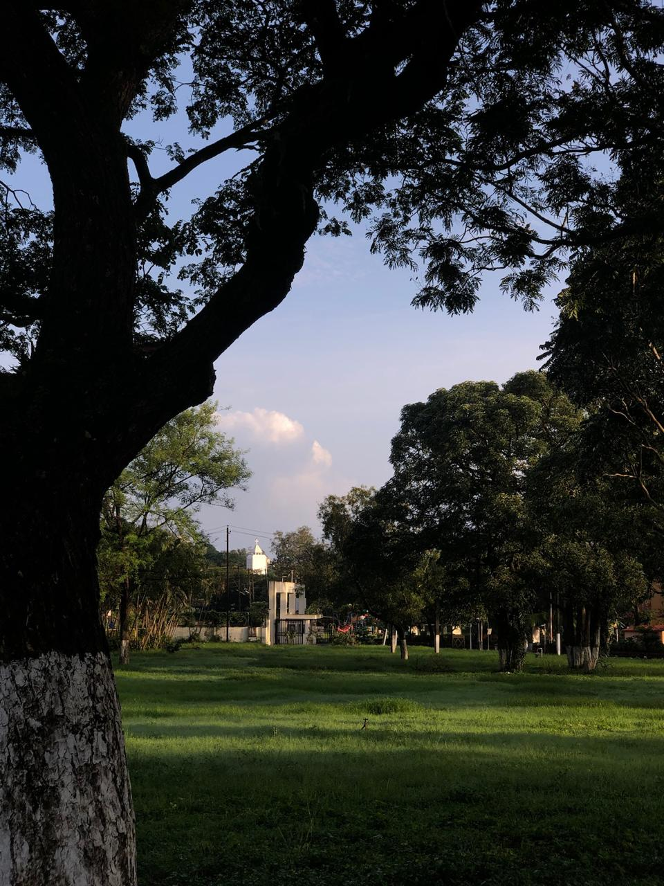
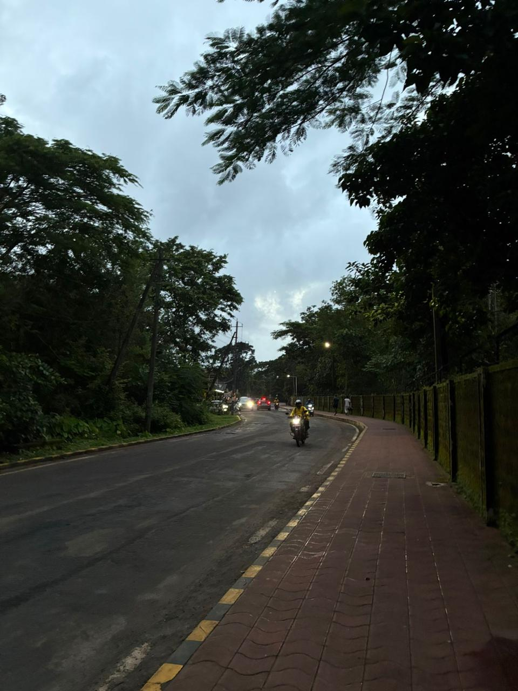
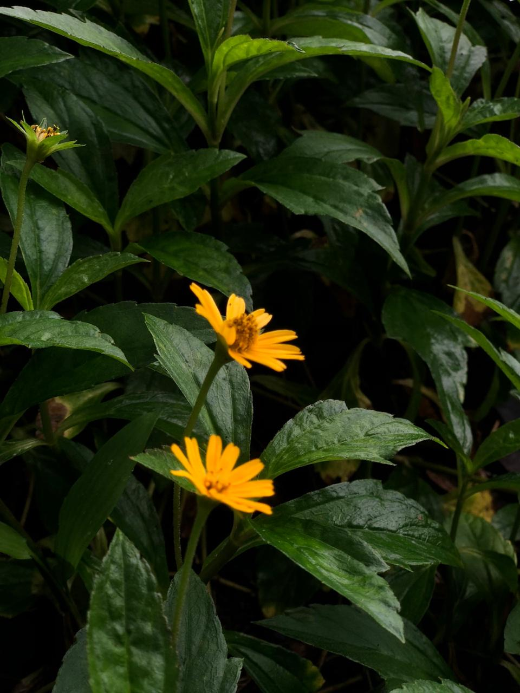

<!DOCTYPE html>
<html lang="en">
<head>
  <meta charset="UTF-8" />
  <meta name="viewport" content="width=device-width, initial-scale=1.0" />
  <title>LensCraft | Photography Gallery</title>
  <link rel="stylesheet" href="css/utilities.css" />
  <link rel="stylesheet" href="css/style.css" />
</head>
<body>
  <!-- Navbar -->
  

    

      <h1 class="logo">LensCraft</h1>
      <nav>
        <ul>
          <li><a href="index.html" class="active">Home</a></li>
          <li><a href="about.html">About</a></li>
          <li><a href="contact.html">Contact</a></li>
        </ul>
      </nav>
    

  

  <!-- Showcase / Hero -->
  <section class="showcase">
    

      

        <h1>Capture The Moment</h1>
        

            Explore a curated collection of stunning photographs from various genres.
            Welcome to LensCraft, where every picture tells a story.
        

        <a href="#gallery" class="btn btn-outline">View Gallery</a>
      

      

        
Say cheese !

        
      

    

  </section>

  <!-- Gallery section -->
  <section id="gallery" class="gallery py-4">
    

      <h2 class="text-center my-2">Gallery</h2>
      

        A selection of my recent work across different photography styles.
        Discovring the world through my lens.
      

      

        

          
          <h3>Landscape</h3>
          
The soothing touch of the land

        

        

          
          <h3>Portrait</h3>
          
Childhood memories 

        

        

          
          <h3>Street</h3>
          
Life in the city street

        

        

          
          <h3>Wildlife</h3>
          
Moments from the wild

        

        

          
          <h3>Macro</h3>
          
Details that matter

        

        

          
          <h3>Events</h3>
          
Stories from special days

        

      

    

  </section>

  <!-- Simple footer -->
  <footer class="footer">
    

      
&copy; 2025 LensCraft

    

  </footer>

  
</body>
</html>
